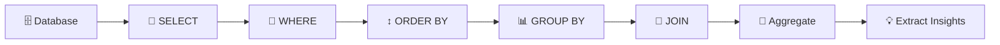
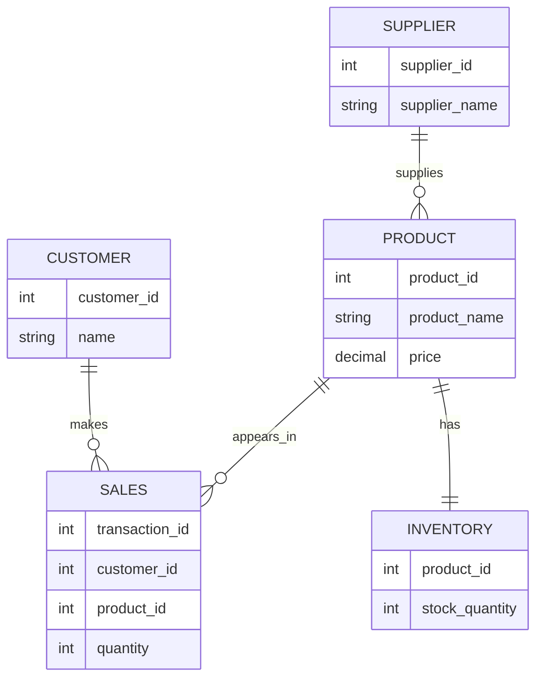
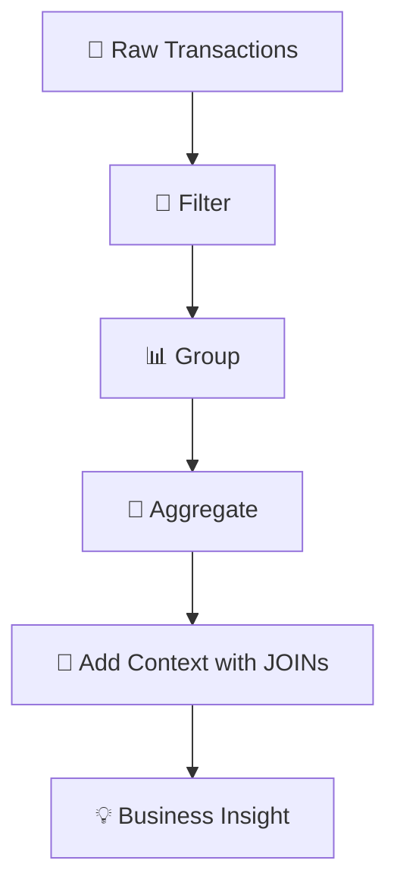

# SQL Database & Data Analysis Project – Data Technician Bootcamp

In this repository, I showcase the database exercises, SQL queries and supporting materials I completed during the **Week 3 Databases & SQL module of the Data Technician Bootcamp**.

## 📊 Project Overview

During this project, I developed an understanding of **relational databases** and used SQL to retrieve, filter, combine and analyse structured data.

I combined database theory with practical exercises using **PostgreSQL and Supabase**, including work with retail-style data involving customers, products, sales, inventory, suppliers and loyalty information.

## 🔄 My SQL Analysis Workflow



## 🛠️ Skills I Demonstrated

### 💻 Core SQL Queries

I practised using:

* `SELECT`
* `FROM`
* `WHERE`
* `ORDER BY`
* `GROUP BY`
* `HAVING`
* `DISTINCT`

### 🧮 Aggregate Functions

I used:

* `COUNT()`
* `SUM()`
* `AVG()`
* `MIN()`
* `MAX()`

to summarise information and calculate useful metrics.

### 🔗 SQL JOINs

I explored different ways of combining tables using:

* `INNER JOIN`
* `LEFT JOIN`
* `RIGHT JOIN`
* `FULL JOIN`
* `CROSS JOIN`
* `SELF JOIN`

### 🔎 Filtering & Conditions

I worked with:

* `AND`
* `OR`
* `NOT`
* `IN`
* `BETWEEN`
* `LIKE`

to create more specific queries.

### 🗃️ Database Design

I developed an understanding of:

* Tables
* Primary keys
* Foreign keys
* Relationships
* One-to-one relationships
* One-to-many relationships
* Many-to-many relationships
* Entity Relationship Diagrams and Schemas

## 📈 Key Project Activities

### 🛍️ Retail Database Design

I designed a relational database structure capable of managing:

* 📅 Dates
* 👤 Customers
* 📦 Products
* 🧾 Sales
* 💰 Costs
* 🎟️ Loyalty information
* 🏪 Inventory
* 🚚 Suppliers

### 🔗 Database Relationships Example



This helped me understand how primary and foreign keys connect information stored across different tables.


### 💻 SQL Query Practice

Using PostgreSQL through **Supabase**, I wrote queries to:

* Retrieve specific records
* Filter information
* Sort results
* Group data
* Calculate totals and averages
* Combine information from different tables

### 🧩 JOIN Analysis

I used JOINs to understand how separate datasets can be combined to answer questions such as:

* Which customers purchased each product?
* Which products generate the most sales?
* Which suppliers provide specific products?
* Which categories perform best?

### 🛠️ Query Debugging

I also identified and corrected syntax errors in SQL queries.

This helped strengthen my understanding of SQL structure and improved my problem-solving skills.

## 💡 Data Analysis with SQL

I learned to use SQL not simply to retrieve records, but to transform database information into analytical outputs.



## 🎯 Learning Outcomes

By completing this project, I developed practical experience in:

* SQL query writing
* PostgreSQL
* Supabase
* Relational databases
* Database design
* Primary and foreign keys
* Filtering
* Sorting
* Grouping
* Aggregation
* SQL JOINs
* Subqueries
* ERDs
* Query debugging
* Extracting insights from structured data

## 💻 Tools I Used

`SQL` `PostgreSQL` `Supabase` `Relational Databases` `ERD` `SQL JOINs` `Data Analysis`

## 📁 Project Contents

```text
📦 SQL-Database-Project
 ┣ 🗄️ Database exercises
 ┣ 💻 SQL queries
 ┣ 🔗 JOIN exercises
 ┣ 🧩 ERD / database design
 ┣ 📊 Query outputs
 ┣ 📁 Supporting datasets
 ┗ 📄 README.md
```
